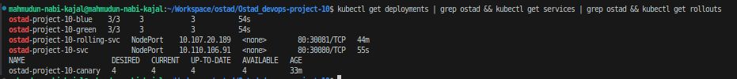
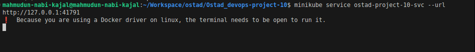
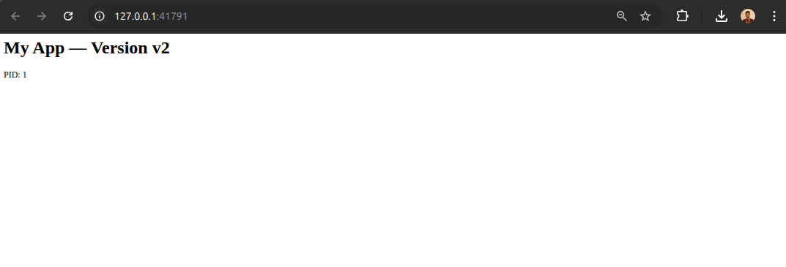
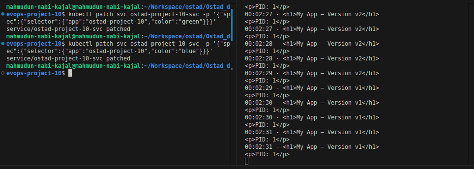
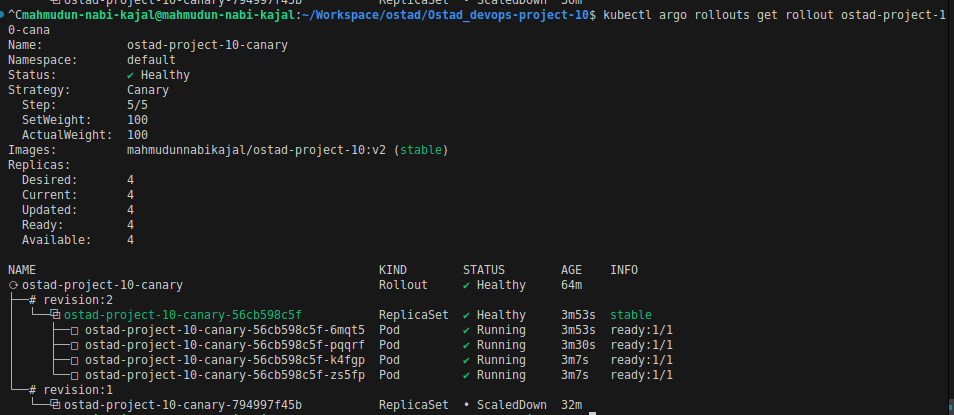
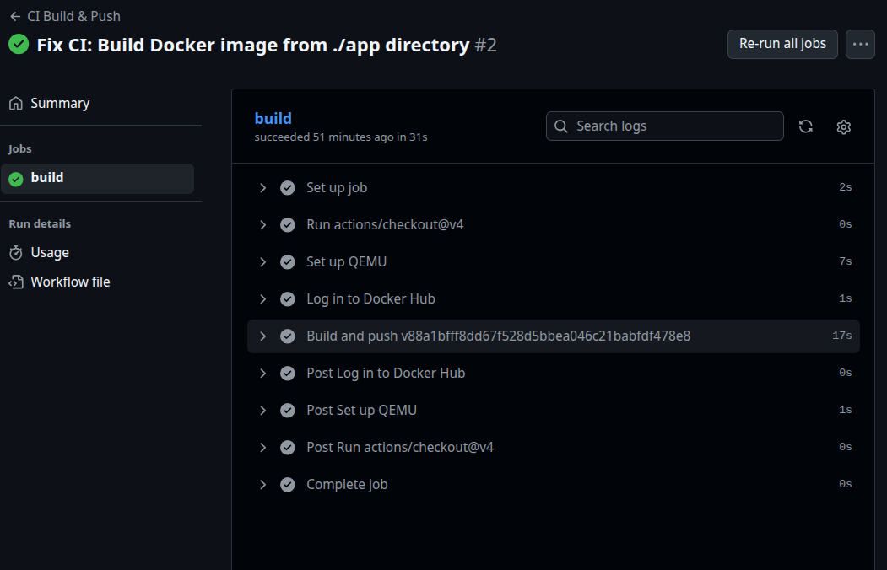
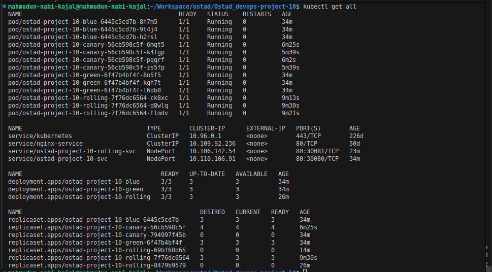

# Ostad Dev Ops Project 10

Zero Downtime Kubernetes Deployments with Blue-Green, Canary, and Rolling Update Strategies

## Screenshots:

- Project overview showing all deployment strategies running

  - 

- Blue-Green deployment URL access

  - 

- Blue-Green deployment switching between versions

  - 

- Zero downtime proof during blue-green switching

  - 

- Canary deployment completed successfully

  - 

- GitHub Actions CI/CD pipeline success

  - 

- All services running successfully
  - 
